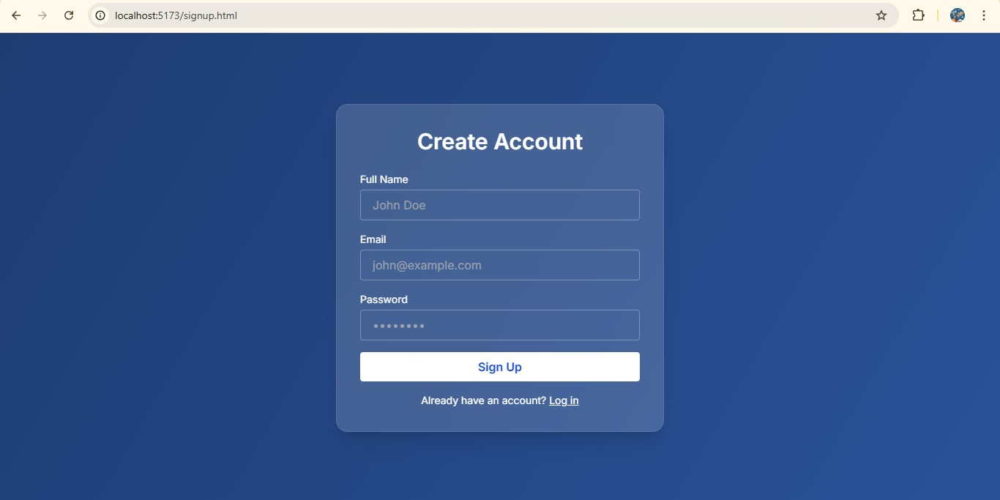
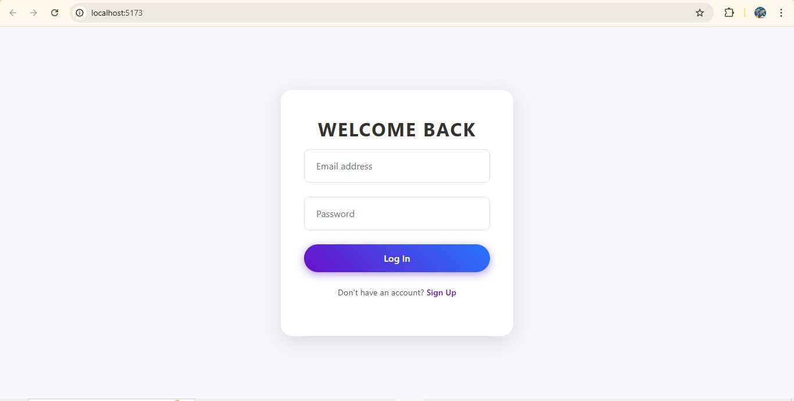
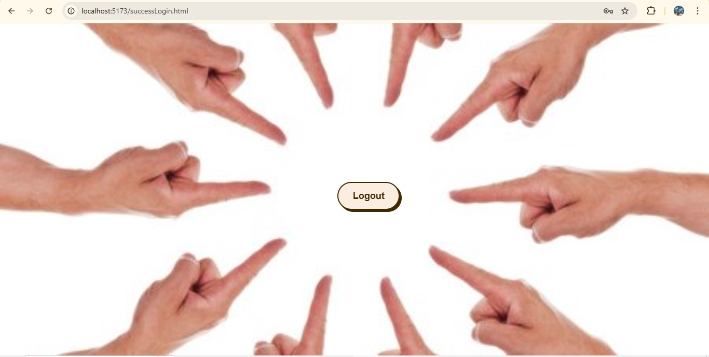

# PRODIGY_FS_01
# 🔐 Full Stack User Authentication App

A simple full-stack authentication project using **HTML/CSS/JavaScript** on the frontend and **Node.js/Express/MongoDB** on the backend.


## 📸 Screenshots

### 📝 Signup Page


### 🔑 Login Page


### ✅ Home Page



## 🌐 Features
```
- ✅ User Signup
- ✅ User Login
- ✅ Password hashing using `bcrypt`
- ✅ JWT-based authentication
- ✅ Protected success screen after login
- ✅ Frontend form validation
- ✅ Simple UI with responsive layout
```
## 📁 Project Structure
```
project-root/
│
├── backend/
│   ├── controllers/
│   │   └── authController.js
│   ├── model/
│   │   └── registeredUser.js
│   ├── routes/
│   │   └── authRoutes.js
│   ├── server.js
│   └── .env
│
├── frontend/
│   ├── signin.html
│   ├── signup.html
│   ├── successLogin.html
│   ├── app.js
│   ├── config.js
│   ├── success.js
│   └── style.css
│
└── README.md
```

## ⚙️ Technologies Used

### 🔧 Backend:
```
- Node.js
- Express.js
- MongoDB + Mongoose
- bcrypt
- JSON Web Tokens (JWT)
```
### 💻 Frontend:
```
- HTML
- CSS
- Vanilla JavaScript
```
## 🚀 Getting Started

### 1️⃣ Clone the repository

```
bash
git clone https://github.com/your-username/auth-app.git
cd auth-app
```
2️⃣ Setup the Backend
```
bash
Copy
Edit
cd backend
npm install
Create a .env file in the backend root:

env
Copy
Edit
PORT=4000
MONGO_URI=mongodb://localhost:27017/authApp
JWT_SECRET=your_secret_key
Start the backend server:

bash
Copy
Edit
npm start
The backend will run on http://localhost:4000.
```

3️⃣ Setup the Frontend
```
Use Live Server in VS Code:

Open the frontend/ folder in VS Code

Right-click on signup.html → "Open with Live Server"

Or use a static server:

bash
Copy
Edit
cd frontend
npx http-server .
The frontend will run on something like http://localhost:8080.
```
🧪 API Endpoints
```
POST /signup
Registers a new user.

POST /signin
Logs in the user and returns token + user data.
```

✅ Usage
```
Visit signup.html to create an account.

After successful signup, you'll be redirected to signin.html.

Login with your credentials.

On success, you'll be shown a welcome screen (successLogin.html).

Logout clears the session and redirects to login.
```
🧱 Environment Variables
```
Place in a .env file (for backend):

env
Copy
Edit
PORT=4000
MONGO_URI=mongodb://localhost:27017/authApp
JWT_SECRET=your_secret_key
```
📌 Future Enhancements
```
Form validations (email format, password rules)

Forgot password / reset flow

Admin login

UI framework (like Tailwind or Bootstrap)
```
```
📄 License
This project is licensed under the MIT License.
```
```
🙌 Author
Made with ❤️ by ASISH
```
